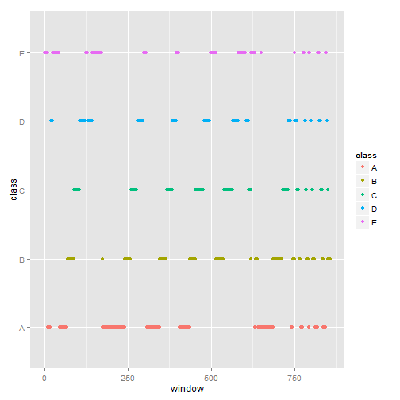
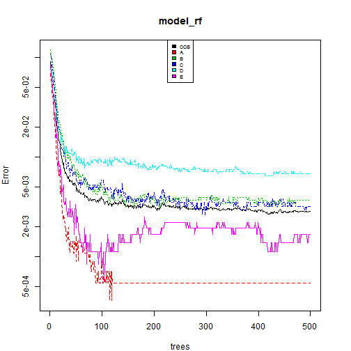

#Practical Machine Learning Course Project   


##Abstract   

Whereas research on activity recognition has usually focused on determining the nature of a specific activity, this course project is interested in predicting its quality.  
Given a set of measures provided by an accelerometer, a magnetometer and a gyroscope , the following aims to evaluate how well an user has performed a weight lifting exercise,the Unilateral Dumbbell Biceps Curl.   
Users were asked to do 10 repetitions of the exercise in different fashions : exactly according to the specification (Class A), throwing the hips to the front (Class E), throwing
the elbows to the front (Class B), lifting the dumbbell only halfway (Class C) and lowering the dumbbell only halfway (Class D).   
The dataset to be used is available [here](https://d396qusza40orc.cloudfront.net/predmachlearn/pml-training.csv) and the details on the experiment are well-described in the original [paper](http://groupware.les.inf.puc-rio.br/public/papers/2013.Velloso.QAR-WLE.pdf).  


##Loading  
Assuming that the dataset has been properly downloaded and saved in the working directory, the code below allows to load it in R :   


```r
##Loads the dataset in R
train<-read.csv("./CourseProject/train.csv",na.strings=c("NA","#DIV/0!"))
test<-read.csv("./CourseProject/test.csv",na.strings=c("NA","#DIV/0!"))
```
  
##Basic Summary   


```r
dim(train)
```

```
## [1] 19622   160
```
There are 19622 observations of 160 variables. Here are the total amount and percentage of missing values : 

```r
sum(is.na(train))##Number of missing values
```

```
## [1] 1925102
```

```r
sum(is.na(train))/(dim(train)[1]*dim(train)[2])
```

```
## [1] 0.6131835
```
The dataset contains about 61% of missing values. 

The following chunk of code breaks down the proportion of missing values by variable :   


```r
##Ratio of NA's by feature
ratio_NA<-sapply(1:dim(train)[2],function(x)sum(is.na(train[,x]))/dim(train)[1])

##Gathers in a dataset
which_NA<-which(ratio_NA>0)
NA_features<-cbind(names(train)[which_NA],ratio_NA[which_NA])
NA_features<-t(NA_features)
NA_features
```

```
##      [,1]                 [,2]                  [,3]               
## [1,] "kurtosis_roll_belt" "kurtosis_picth_belt" "kurtosis_yaw_belt"
## [2,] "0.979818570991744"  "0.980939761492203"   "1"                
##      [,4]                 [,5]                   [,6]               
## [1,] "skewness_roll_belt" "skewness_roll_belt.1" "skewness_yaw_belt"
## [2,] "0.979767607787178"  "0.980939761492203"    "1"                
##      [,7]                [,8]                [,9]               
## [1,] "max_roll_belt"     "max_picth_belt"    "max_yaw_belt"     
## [2,] "0.979308938946081" "0.979308938946081" "0.979818570991744"
##      [,10]               [,11]               [,12]              
## [1,] "min_roll_belt"     "min_pitch_belt"    "min_yaw_belt"     
## [2,] "0.979308938946081" "0.979308938946081" "0.979818570991744"
##      [,13]                 [,14]                  [,15]               
## [1,] "amplitude_roll_belt" "amplitude_pitch_belt" "amplitude_yaw_belt"
## [2,] "0.979308938946081"   "0.979308938946081"    "0.979818570991744" 
##      [,16]                  [,17]               [,18]              
## [1,] "var_total_accel_belt" "avg_roll_belt"     "stddev_roll_belt" 
## [2,] "0.979308938946081"    "0.979308938946081" "0.979308938946081"
##      [,19]               [,20]               [,21]              
## [1,] "var_roll_belt"     "avg_pitch_belt"    "stddev_pitch_belt"
## [2,] "0.979308938946081" "0.979308938946081" "0.979308938946081"
##      [,22]               [,23]               [,24]              
## [1,] "var_pitch_belt"    "avg_yaw_belt"      "stddev_yaw_belt"  
## [2,] "0.979308938946081" "0.979308938946081" "0.979308938946081"
##      [,25]               [,26]               [,27]              
## [1,] "var_yaw_belt"      "var_accel_arm"     "avg_roll_arm"     
## [2,] "0.979308938946081" "0.979308938946081" "0.979308938946081"
##      [,28]               [,29]               [,30]              
## [1,] "stddev_roll_arm"   "var_roll_arm"      "avg_pitch_arm"    
## [2,] "0.979308938946081" "0.979308938946081" "0.979308938946081"
##      [,31]               [,32]               [,33]              
## [1,] "stddev_pitch_arm"  "var_pitch_arm"     "avg_yaw_arm"      
## [2,] "0.979308938946081" "0.979308938946081" "0.979308938946081"
##      [,34]               [,35]               [,36]              
## [1,] "stddev_yaw_arm"    "var_yaw_arm"       "kurtosis_roll_arm"
## [2,] "0.979308938946081" "0.979308938946081" "0.983284068902253"
##      [,37]                [,38]              [,39]              
## [1,] "kurtosis_picth_arm" "kurtosis_yaw_arm" "skewness_roll_arm"
## [2,] "0.983385995311385"  "0.97986953419631" "0.983233105697686"
##      [,40]                [,41]              [,42]              
## [1,] "skewness_pitch_arm" "skewness_yaw_arm" "max_roll_arm"     
## [2,] "0.983385995311385"  "0.97986953419631" "0.979308938946081"
##      [,43]               [,44]               [,45]              
## [1,] "max_picth_arm"     "max_yaw_arm"       "min_roll_arm"     
## [2,] "0.979308938946081" "0.979308938946081" "0.979308938946081"
##      [,46]               [,47]               [,48]               
## [1,] "min_pitch_arm"     "min_yaw_arm"       "amplitude_roll_arm"
## [2,] "0.979308938946081" "0.979308938946081" "0.979308938946081" 
##      [,49]                 [,50]               [,51]                   
## [1,] "amplitude_pitch_arm" "amplitude_yaw_arm" "kurtosis_roll_dumbbell"
## [2,] "0.979308938946081"   "0.979308938946081" "0.979563754968912"     
##      [,52]                     [,53]                  
## [1,] "kurtosis_picth_dumbbell" "kurtosis_yaw_dumbbell"
## [2,] "0.979410865355213"       "1"                    
##      [,54]                    [,55]                    
## [1,] "skewness_roll_dumbbell" "skewness_pitch_dumbbell"
## [2,] "0.979512791764346"      "0.979359902150647"      
##      [,56]                   [,57]               [,58]               
## [1,] "skewness_yaw_dumbbell" "max_roll_dumbbell" "max_picth_dumbbell"
## [2,] "1"                     "0.979308938946081" "0.979308938946081" 
##      [,59]               [,60]               [,61]               
## [1,] "max_yaw_dumbbell"  "min_roll_dumbbell" "min_pitch_dumbbell"
## [2,] "0.979563754968912" "0.979308938946081" "0.979308938946081" 
##      [,62]               [,63]                    
## [1,] "min_yaw_dumbbell"  "amplitude_roll_dumbbell"
## [2,] "0.979563754968912" "0.979308938946081"      
##      [,64]                      [,65]                   
## [1,] "amplitude_pitch_dumbbell" "amplitude_yaw_dumbbell"
## [2,] "0.979308938946081"        "0.979563754968912"     
##      [,66]                [,67]               [,68]                 
## [1,] "var_accel_dumbbell" "avg_roll_dumbbell" "stddev_roll_dumbbell"
## [2,] "0.979308938946081"  "0.979308938946081" "0.979308938946081"   
##      [,69]               [,70]                [,71]                  
## [1,] "var_roll_dumbbell" "avg_pitch_dumbbell" "stddev_pitch_dumbbell"
## [2,] "0.979308938946081" "0.979308938946081"  "0.979308938946081"    
##      [,72]                [,73]               [,74]                
## [1,] "var_pitch_dumbbell" "avg_yaw_dumbbell"  "stddev_yaw_dumbbell"
## [2,] "0.979308938946081"  "0.979308938946081" "0.979308938946081"  
##      [,75]               [,76]                   [,77]                   
## [1,] "var_yaw_dumbbell"  "kurtosis_roll_forearm" "kurtosis_picth_forearm"
## [2,] "0.979308938946081" "0.98358984812965"      "0.983640811334217"     
##      [,78]                  [,79]                  
## [1,] "kurtosis_yaw_forearm" "skewness_roll_forearm"
## [2,] "1"                    "0.983538884925084"    
##      [,80]                    [,81]                  [,82]              
## [1,] "skewness_pitch_forearm" "skewness_yaw_forearm" "max_roll_forearm" 
## [2,] "0.983640811334217"      "1"                    "0.979308938946081"
##      [,83]               [,84]              [,85]              
## [1,] "max_picth_forearm" "max_yaw_forearm"  "min_roll_forearm" 
## [2,] "0.979308938946081" "0.98358984812965" "0.979308938946081"
##      [,86]               [,87]              [,88]                   
## [1,] "min_pitch_forearm" "min_yaw_forearm"  "amplitude_roll_forearm"
## [2,] "0.979308938946081" "0.98358984812965" "0.979308938946081"     
##      [,89]                     [,90]                   [,91]              
## [1,] "amplitude_pitch_forearm" "amplitude_yaw_forearm" "var_accel_forearm"
## [2,] "0.979308938946081"       "0.98358984812965"      "0.979308938946081"
##      [,92]               [,93]                 [,94]              
## [1,] "avg_roll_forearm"  "stddev_roll_forearm" "var_roll_forearm" 
## [2,] "0.979308938946081" "0.979308938946081"   "0.979308938946081"
##      [,95]               [,96]                  [,97]              
## [1,] "avg_pitch_forearm" "stddev_pitch_forearm" "var_pitch_forearm"
## [2,] "0.979308938946081" "0.979308938946081"    "0.979308938946081"
##      [,98]               [,99]                [,100]             
## [1,] "avg_yaw_forearm"   "stddev_yaw_forearm" "var_yaw_forearm"  
## [2,] "0.979308938946081" "0.979308938946081"  "0.979308938946081"
```

There are 100 features which contain more than 97% of missing values. These variables are in fact summary statistics (variance, standard deviation, maximum, minimum, skewness,amplitude and kurtosis).  

This is explained by the way the researchers have conducted the experiment. The measurements of the gyroscope, the accelerometer and the magnetometer and their Euler's angles are provided at a sampling rate of 45Hz. A sliding window (with different lengths from 0.5 and 2.5 seconds and with 0.5 seconds overlap) splits the dataset in continuous time slices. For each time slice, these summary features are calculated on the Euler's angles.

```r
length(unique(train$num_window))
```

```
## [1] 858
```
The dataset is splitted in 858 time series.   

The following chunk of code allows to plot the exercise's by window number.   


```r
library(ggplot2)

class_by_window<-c()

##Class of exercise for each window :
for(i in 1:length(unique(train$num_window))){
        class_window<-mean(as.numeric(train$classe[train$num_window==i]))
        class_by_window<-rbind(class_by_window,c(i,class_window))
}
class_by_window<-data.frame(class_by_window[,1],class_by_window[,2]);names(class_by_window)<-c("window","class");class_by_window<-na.omit(class_by_window);class_by_window$class<-as.factor(class_by_window$class);levels(class_by_window$class)<-c("A","B","C","D","E")

##Plots with ggplot2
q<-qplot(data=class_by_window,window,class,colour=class);q
```

 

This stepped pattern plot displays the order in which the different exercises were made (repeatedly A,B,C,D,E) and the overlap between consecutive windows.   

Besides, the variables *"raw_timestamp_part_1"* and *"raw_timestamp_part_2"* are respectively the UNIX timestamp and an arbitrary timestamp for the experiment based on the sampling rate of 45Hz.  

```r
train$raw_timestamp_part_1<-as.POSIXct(train$raw_timestamp_part_1,
                                       origin="1970-01-01",tz="GMT")
range(train$raw_timestamp_part_1)  
```

```
## [1] "2011-11-28 14:13:25 GMT" "2011-12-05 14:24:41 GMT"
```
The experiments were done between November 28, 2011 and December 05, 2011 with usually a break between roughly 12 o'clock and 2pm, lunchtime is lunchtime !  

##Feature Selection    
The researchers have used the feature selection algorithm of *Hall*. They have been able to select 17 features which best summary the data. This feature selection is out the scope of this course project as we would not be able to operate the same transformations on the test set given by the instructors. 
   
   
Prior to building a classifier, we can remove :  

 - features which summary measurements for each window  (listed above)
 - features *"X","user_name","raw_timestamp_part_1","raw_timestamp_part_2","cvtd_timestamp","new_window","num_window"* that are not useful for our predicting purpose


```r
##Removes the 'summary' features
train<-train[,-which_NA]

##Removes the 7 first features
train<-train[,-c(1:7)]

##Verifies if there are remaining NA's
sum(is.na(train))  
```

```
## [1] 0
```

The *test set* has to be processed in the same way :   

```r
test<-test[,-which_NA]
test<-test[,-c(1:7)]
```

##Classification   
Two algorithms will be compared : a **classification tree** and an ensembling method, the **random forest**.   
For the purposes of choosing between these two algorithms and appraise their out-of-sample errors, a 3-fold cross validation is carried out :   


```r
library(caret);library(rpart);library(randomForest)
set.seed(1306)

##Creates 3 folds
k<-3
folds<-createFolds(y=train$classe,k)

valid_cv<-c();cv_tree<-c();cv_rf<-c()

##Performs the 3-fold cross validation
cv<-for(i in 1:k){
        test_fold<-train[folds[[i]],]
        train_fold<-train[-folds[[i]],]
        
        ##CART model on train fold
        tree<-rpart(data=train,classe~.)
        
        ##Random forest model on train fold
        rf<-randomForest(x=train_fold[,-53],y=train_fold$classe)
        
        ##Predicts on test fold
        predict_tree<-predict(tree,test_fold[,-53],type="class")
        predict_rf<-predict(rf,test_fold[,-53])
        
        ##Obtains the accuracies
        cv_tree<-rbind(cv_tree,confusionMatrix(test_fold$classe,predict_tree)$overall[1])
        cv_rf<-rbind(cv_rf,confusionMatrix(test_fold$classe,predict_rf)$overall[1])
        }

##Gathers the results
cv_both<-data.frame(cv_tree,cv_rf);names(cv_both)<-c("tree","random forest")

cv_both
```

```
##        tree random forest
## 1 0.7521407     0.9935780
## 2 0.7575665     0.9938857
## 3 0.7571865     0.9923547
```
The random forest classifier is far more precise than the tree-based model (roughly 99% Vs 75%). The estimated **out-of-sample error with the random forest model can be estimated at about less than 1%**.   
Here's a plot of the errors of the random forest classifier :  
   
   

```r
##Builds a random forest model on train set
model_rf<-randomForest(x=train[,-53],y=train$classe)

##Sets graphic parameters and plots
par(mar=c(4,4,4,3))
plot(model_rf,log="y")
legend("top", colnames(model_rf$err.rate),col=1:6,cex=0.6,fill=1:6)
```

 

The errors decrease fastly from the 1st to the 50th tree and then reach a plateau.  
   
   
Also, the model seems more accurate for the extreme classes. That is, when the exercise is made totally according to the specification (Class A) or totally differently (throwing the hips to the front, Class E).   
It has more difficulty to predict the 'intermediary exercises', in other words when the exercise is performed 'half-well' (throwing the elbows to the front, Class B, lifting the dumbbell only halfway, Class C and lowering the dumbbell only halfway, Class D).   

##Submission results   
Finally, we can apply the model to the test data from course project :   


```r
##Predicts with test data
answers<-predict(model_rf,test)

##Creates a text file for each test
pml_write_files = function(x){
  n = length(x)
  for(i in 1:n){
    filename = paste0("problem_id_",i,".txt")
    write.table(x[i],file=filename,quote=FALSE,row.names=FALSE,col.names=FALSE)
  }
}
answers
```

```
##  1  2  3  4  5  6  7  8  9 10 11 12 13 14 15 16 17 18 19 20 
##  B  A  B  A  A  E  D  B  A  A  B  C  B  A  E  E  A  B  B  B 
## Levels: A B C D E
```
The predicted classes for the 20 tests are : B  A  B  A  A  E  D  B  A  A  B  C  B  A  E  E  A  B  B  B. 

##References   
* Velloso, E.; Bulling, A.; Gellersen, H.; Ugulino, W.; Fuks, H. **Qualitative Activity Recognition of Weight Lifting Exercises**. Proceedings of 4th International Conference in Cooperation with SIGCHI (Augmented Human '13) . Stuttgart, Germany: ACM SIGCHI, 2013.   


